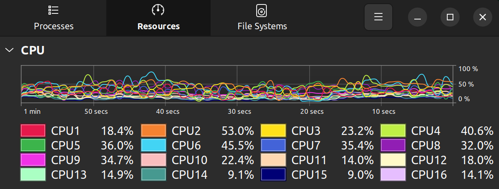

### Features

- Access ZED frames via Open Capture API

- Color-based object detection using HSV filtering

- Depth estimation

- CPU-only processing

### Requirements

- ZED Open Capture SDK

- OpenCV

- CMake

### Build & Run

       git clone https://github.com/ichsanyudika12/zed-oc-api-seg.git
       cd zed-oc-api-seg
       mkdir build && cd build
       cmake ..
       make
       
       ./main

### Result

 

